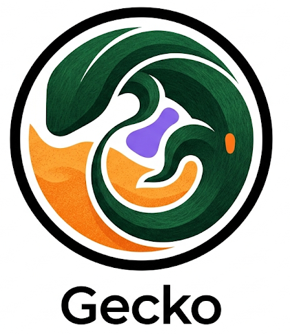
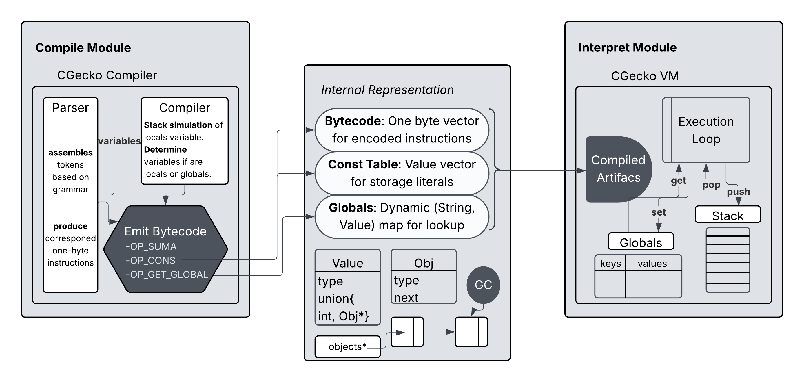

<div align="center">
<h1>
  
</h1>


</div>

---

## Lenguajes, Interpretes y Compiladores

CGecko es un **interprete** que compila a bytecode para el Gecko **Language**. 

Su arquitectura permite entender como funcionan los interpretes de lenguajes reales como Java o Lua. 

El problema de implementar lenguajes trae varias dualidades que puedes entender con CGecko: VM-Compilador Arquitectura-Organizacion Stack-Bytecode

---

## Arcquitectura

<div align="center">
 
</div>

---

## Build & run

```bash
git clone https://github.com/Joacoromero06/CGecko
cd cgecko
make
./cgecko test/t1.txt
```

---

## Evaluación

Aun no fue evaluado ni testeado.

---

## Referencias
Si te interesa Lenguajes, Compiladores, Interpretes o solo quieres mejorar como profesional te recomiendo leer estos libros/documentos:

[1] Robert W. Sebesta — Concepts of programming Languages 11th edition.

[2] Bruce Tate — Programming: Seven Languages in Seven Weeks

[3] Nystrom, R. — Crafting Interpreters (2021)

[4] Aho et al. — Compilers: Principles, Techniques & Tools (Dragon Book)


---

