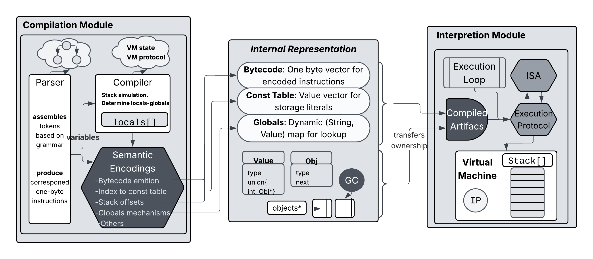

<div align="center">
<h1>
  
</h1>


</div>

---

## Lenguajes, Interpretes y Compiladores

CGecko es un **Interprete** que __internamente compila__ a bytecode para el Gecko **Language**, pero no es un **Compilador**. 

Su arquitectura permite entender como funcionan los interpretes de lenguajes reales como **Java** o **Lua**. 

El problema de implementar lenguajes trae varias **dualidades** que puedes entender con CGecko: VM-Compilador Arquitectura-Organizacion Stack-Bytecode

---

## Arquitectura

La **arquitectura de interpetes** consiste en la organizacion de aquellas _abstracciones_ que permiten la implmentacion de un _interprete_.
Un interprete no es mas que una _pieza de software_ que tiene como **datos de entrada** otra _pieza de software_. 

En este caso CGecko es un interprete escrito en **C** (como cualquier otro programa), y para ejecutarse necesita **compilarse** y para **ejecutarse**, debe _recibir un programa escrito en el lenguaje Gecko_ con su sintaxis acorde. 

<div align="center">
 
  <br></br>
 <figcaption><em>La arquitectura de CGecko y las distintas abstracciones que permiten su implementacion.</em></figcaption>
</div>

---

## Build & run

```bash
git clone https://github.com/Joacoromero06/CGecko
cd cgecko
rm -rf build             # borrar el binario y compilar desde cero
mkdir build && cd build  # crear directorio para compilar
cmake -G Ninja ..        # es necesario los paquetes ninja y cmake para una compilacion mas rapida
ninja                    # linkear el object file
```
```bash
# desde /build
./Gecko < ../test/sqrt2_inline.gk
```
---

## Evaluación con el algoritmo Newton Raphson
Se evaluó el **algoritmo** newton-raphson para obtener una _aproximacion de 3 puntos decimales_ de precision del valor **$\sqrt{2}$.**

Como $\sqrt{2}$ es un _irracional_ **que cumple** $x = \sqrt{2}$ tambien cumplira $x² = 2$. **Planteando** una funcion cuya raiz sea $\sqrt{2}$: $0 = x² - 2$

_Aplicando_ el conocido algoritmo: 

$$x_{next} = x - \frac{f(x)}{f'(x)}$$
-

Obtenemos la formula de iteracion: 

$$x_{next} = x - \frac{(x² - 2)}{2x} \iff x_{next} = \frac{x}{2} + \frac{1}{x} \iff x_{next} = \frac{1}{2}(x + \frac{2}{x})$$

---
### Pequeña explicacion
Si nos damos cuenta la formula es la **media aritmetica** de $x$ y $\frac{2}{x}$. Lo cual tiene sentido con el siguiente analisis:

Sea la ecuacion de punto fijo relacionada al mismo problema:

$$x² = 2 \iff x = \frac{2}{x} \iff x = g(x)$$


La solucion, o punto fijo es $\sqrt{2}$, pero esta $g(x)$ no satisface las hipotesis del **teorema de punto fijo de Banach** ya que $g$ no es una _funcion contractiva_:

$$ g'(\sqrt{2}) = \frac{-2}{x²}\Bigg|_{x=\sqrt{2}} = |-1| = 1 $$


Justamente lo que hace **newton**, es _a partir de una ecuacion de punto fijo_, utilizando el **teorema de taylor** logra eliminar el factor $g'(x)$ _algebraicamente_, con el objetivo de que el error sea el de $\frac{g''(x)e²}{2}$. 
Este es un caso ejemplar ya que la **formula de iteracion de newton** nos quedo:  $f(x) = \frac{1}{2} (x + \frac{2}{x})$. Su derivada evaluada en la raiz es cero lo que nos asegura **superconvergencia cuadratica**.

$$f'(\sqrt{2}) = \frac{1}{2} (1 - \frac{2}{x²}|_{\sqrt{2}}) = \frac{1}{2} (1 - 1) = 0$$

---

### La traduccion del algoritmo a Gecko Language
```python
let x = 2;
let x_next = 0;
let n = 100;
let i = 1;

let b = true;
let diff = 1;
let e = 0.0001;
while (b and i < n) {
  x_next = (x+2/x)/2;
  diff = x_next - x;
  if diff < 0 then diff = diff * -1;
  if diff < e then 
    b = false;
  else {x = x_next; i = i + 1; }
}
print x_next;
```
---

## Bytecode de Newton-Raphson para $\sqrt{2}$
El interprete viene con la flag activada para dissasmbly de esa manera para cada instruccion interpretada se muestra su codigo de un byte.
```markdown
| IP     | Opcode                  | Operandos               |
|--------|-------------------------|-------------------------|
| 0000   | OP_CONST                | pstack:0001 '2'         |
| 0002   | OP_DECLARACION_GLOBAL   | pstack:0000 'x'         |
| 0004   | OP_CONST                | pstack:0003 '0'         |
| 0006   | OP_DECLARACION_GLOBAL   | pstack:0002 'x_next'    |
| 0008   | OP_CONST                | pstack:0005 '100'       |
| 0010   | OP_DECLARACION_GLOBAL   | pstack:0004 'n'         |
| 0012   | OP_CONST                | pstack:0007 '1'         |
| 0014   | OP_DECLARACION_GLOBAL   | pstack:0006 'i'         |
| 0016   | OP_TRUE                 |                         |
| 0017   | OP_DECLARACION_GLOBAL   | pstack:0008 'b'         |
| 0019   | OP_CONST                | pstack:0010 '1'         |
| 0021   | OP_DECLARACION_GLOBAL   | pstack:0009 'diff'      |
| 0023   | OP_CONST                | pstack:0012 '0.0001'    |
| 0025   | OP_DECLARACION_GLOBAL   | pstack:0011 'e'         |
| 0027   | OP_GET_GLOBAL           | pstack:0013 'b'         |
| 0029   | OP_JUMP_IF_FALSE        | 29 -> 38                |
| 0032   | OP_POP                  |                         |
| 0033   | OP_GET_GLOBAL           | pstack:0014 'i'         |
| 0035   | OP_GET_GLOBAL           | pstack:0015 'n'         |
| ...    | ...                     | ...                     |
| 0122   | OP_PRINT                |                         |
```

## Ejecutar el algoritmo de Newton-Raphson
```bash
# en /build
./Gecko < ../test/sqrt2_inline.gk
# Obtendra como resultado

# Bytecode del algoritmo

# Traza de la ejecucion del algoritmo y estado del stack

# Resultado en pantalla.
```

## REPL y Ejecucion por Lote
```bash
# Para utilizar el modo read-eval-print loop
./Gecko
>//aqui escribes codigo Gecko
```

```bash
# Para utilizar la clasica ejecucion por lote
./Gecko < <ruta_archivo.gk>
# Nota: la ejecucion por lote puede traerte inconvenientes debido a errores de sintaxis, mil disculpas!
```

---

## Sobre el proyecto
Gecko es un lenguaje pequelo y de caso de estudio en el que sigo trabajando. Tiene muchos errores y especialmente carece de una buena interfaz amigable para usuarios comunes. Lo mas interesante del proyecto es que fue utilizado para la presentacion de un trabajo académico y que esta en desarrollo y tiene pendiente muchas optimizaciones.


## Referencias
Si te interesa Lenguajes, Compiladores, Interpretes o solo quieres mejorar como profesional te recomiendo leer estos libros/documentos:

[1] Robert W. Sebesta — Concepts of programming Languages 11th edition.

[2] Bruce Tate — Programming: Seven Languages in Seven Weeks

[3] Nystrom, R. — Crafting Interpreters (2021)

[4] Aho et al. — Compilers: Principles, Techniques & Tools (Dragon Book)


---

